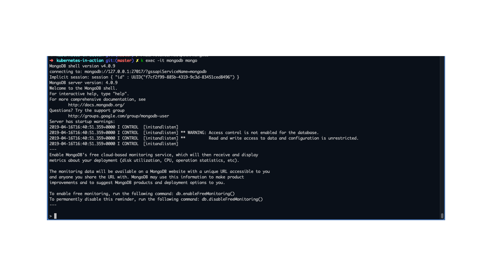
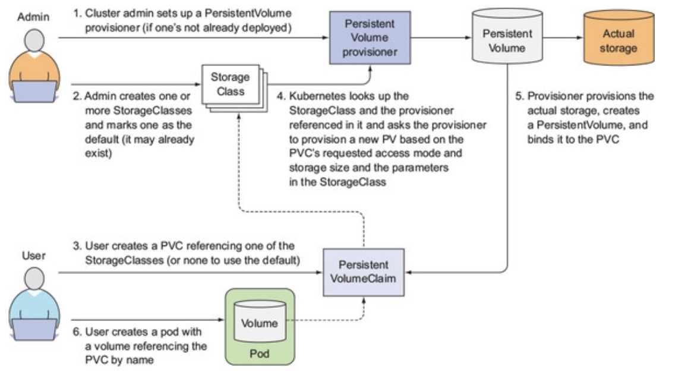

## Notes for going through the Kubernetes in Action
Github link: https://github.com/luksa/kubernetes-in-action
### Chapter 4
##### Create replication controller
```bash
k create -f ./kubia-rc.yml
```

### Chapter 5 - Services and Ingress
#### Services
##### Create service
```bash
k create -f ./kubia-svc.yml
```
##### Get Service
```bash
k get service
```
##### Test service from another pod
```bash
k exec <pod_name> -- curl -s http://<svc_ip>
```
##### Service Endpoints
These are the resource which routes traffic from clients to the pods which are part of the service. The selector in the service config is used to build a list of endpoints (IPs and ports) and this is used to route the traffic to the pod.
<br>
You can check the endpoint like any other resource:
```bash
k get endpoint kubia
```
##### Create node port
This is a mapping of a k8s node port to a port for a pod
````bash
k create -f ./nodeport.yml
````

#### Ingress
Maps an ingress controller to a pod. Operates on <u>layer 7</u> so has the flexibility to route hostname/app1 and hostname/app2 to different services and therefore pods.
<br>
Requires an ingress controller. This can be enabled with minikube with `minikube addons enable ingress`. Get the IP of the controller with `minikube service list` - you're looking for the "default-http-backend"
<br>
The below will route requests to the `host/test` value of the template to `kubia-nodeport` service
```bash
k create -f ./ingress.yml
```
<b>Note:</b> You can test this using cURL:<br>
`curl -X GET 'http://minikube.eddy.com/test`
<br>or<br>
`curl -X GET 'http://<IP_OF_INGRESS_CONTROLLER>/test -H 'Host: minikube.eddy.com'`
<br>
(Where the host is whatever is specified in the ingress object)

###### Note how ingresses works
1. Request is sent to URL (eg minikube.eddy.com/test)
2. DNS resolves this to the IP of the ingress controller
3. Client sends HTTP request to the ingress controller with `minikube.eddy.com` in the host header
4. From the header, the controller determines the service that the client is trying to access, looked up the pod IPs via the Endpoints object associated with the service and forwarded the request to one of the pods.
<b>Note:</b> The ingress controller doesn't forward requests to the service, rather it gets the endpoints from the service and forwards to the pods directly. Most ingress controllers work like this.
<br><br>


##### Enabling HTTPS for an ingress
1. Create a self signed certificate and key (page 241 // 147)
```bash
openssl genrsa -out tls.key 2048
openssl req -new -x509 -key tls.key -out tls.cert -days 360 -subj /CN=minikube.eddy.com
```
2. Then create a secret from the 2 files
```bash
k create secret tls tls-secret --cert=tls.cert --key=tls.key
```

3. Deploy the app using the following template:
```bash
k create -f ingress-tls.yml
```
or if the deployment already exists, update it:
```bash
k apply -f ingress-tls.yml
```

#### Readiness Probes
- A failed readiness probe removes the pod IP from the list of endpoints for the associated service.
- They will not kill or restart a container. Liveness probes will but readiness probes won't.
- You configure a time to wait before the readiness probe starts polling.
- The readiness probe polls at certain intervals (10 seconds by default).
- An example of where you'd use one:
  - Your app has front end pods which connect to a back end database.
  - Your front end pods have connectivity problems to the database
  - You'd want the readiness probe to fail, which would remove the pod IP from the service (but not kill the pod).
  - This is different to a liveness probe which (if it had the same check) would kill the pod - even though there's nothing wrong with the pod.
  
#### Run a single pod with the dnsutils tools, on the fly
```bash
k run dnsutils --image=tutum/dnsutils --generator=run-pod/v1 --command -- sleep infinity
```
Note: the `--generator=run-pod/v1` part tells K8s to create a pod without a replication controller or similar behind it.

### Chapter 6 - Storage

#### - Non-Persistent Storage -
#### Creating shared volumes with "emptyDir" type

This will deploy an app (built from ./dockerfiles-fortune) which will write a file of random quotes, using the "fortune" application. The web-server component of this (running nginx:alpine) will serve this quote as an HTML file

```bash
k create -f fortune-pod.yml
k port-forward fortune 8080:80 &
```

You can create the emptyDir volume on the host's memory with the following template:

```bash
k create -f fortune-pod-volume-in-memory.yml
```

#### Create a shared volume with "gitRepo" type

This will deploy a shared volume, similar to the "emptyDir" type except it will clone the contents of a git repo into it. The contents of the repo is only copied when the pod is created so in order to update the content of the volume, you'd have to delete the pod and recreate it (or deploy the pod using a replication controller and only delete the pod).

```bash
k create -f gitrepo-volume-pod.yml
k port-forward gitrepo-volume-pod 8080:80 &
```

Note: You can't clone from a private repo. The K8s devs wanted to keep the volume type simple so cloning from a private repo would need to be done via a git sync sidecar.

#### - Persistent Storage - 
#### Create a hostPath volume

This is a mounted path from the k8s worker nodes filesystem. The data exists on the worker node so any pod scheduled to that specific node and has config which will map a volume to that path will see the data. .

They are typically used to give access of the hosts' filesystem to the pods (eg to consume log files, CA certificates or the K8s config file (kubeconfig)).

Note: Only use `hostPath` if you need to read/write system files on the worker node. They should not be used to persist data across pods.

In order to create a directory on the minikube node, you have to SSH onto it and create the directory:

```bash
minikube ssh
sudo mkdir -p /k8s/volumes/hostpath/mongodb
```

#### Deploy mongodb container using the above created hostPath

This will create the container running MongoDb (using a host path on the minikube node). The second command will test access to the the mongodb server. 

```bash
k create -f mongodb-pod-hostpath-pd.yml
k exec -it mongodb mongo
```

Example of how it should look if sucessfull:


The rest of the MongoDB commands to create a simple JSON document can be found on page 276 (ebook version)

Test MongoDB commands to check existing document:
```bash
use mystore
db.foo.find()
```

#### Persistent Volumes (and PV Claims)

They work like this:


**Note:** PVs do not belong to any namespace. They are cluster-level resources (like nodes). Persistent Volume Claims however ___do___ belong to a namespace and can only be used by pods in the same namespace.


Create a persistent volume (which maps to the same hostPath directoy on the minikube node) like this:

```bash
k create -f mongodb-hostpath-pv.yml
```

To create the claim, run:

```bash
k create -f mongodb-hostpath-pvc.yml
```

If you list the PVCs, you'll notice that the claim is bound to the persistent volume that was created earlier.

The access modes:

|Access Mode|Meaning|Use|
|---|---|---|
|ROW|ReadWriteOnce|Only a single node and mount a volume|
|ROX|ReadOnlyMany|Multiple nodes can mount a volume for reading|
|RWX|ReadWriteMany|Multiple nodes can mount a volume for read/write|

**Note:** The above access modes are for ___nodes___, not pods.

To deploy a mongoDB pod, using this new PVC, run: 

```bash
k create -f mongodb-pod-pvc.yml
```

#### Dynamic PV Provisioning

Instead of the cluster admin creating the persistent volumes before hand, you can deploy a persistent volume provisioner and define one or more StorageClass objects and let users choose what they want. Users can refer to the StorageClass in their PVC. StorageClass objects are not namespaced..

With minikube, you can test this by deploying the following provisioner

```bash
k create -f storageclass-fast-hostpath.yml
```

**Note:** This creates a storage class resource which will be used by PVC to create new PV on the fly. The concept of PVC and PVs is still the same, the difference is that the PVs don't have to exist beforehand.

Then create a PV by deploying the following PVC:

```bash
k create -f mongodb-storageclass-pvc.yml
```

**Note:** This creates a hostPath PV on the minikube node. The StorageClass provisioner has done this when the PVC was created.

The point of StorageClasses is that they're referable by name and are therefore easily portable to other clusters (providing the StorageClasses with the same name exist there)

The below image illistrates how storage classes work:



### Chapter 7 - Secrets and ConfigMaps
#### Config Maps

##### CMD, Entrypoint Terminology

The terminology differences between Dockerfiles and Kubernetes:


##### Parameters and Environment Variables

Rather than hard coding values in pods, you can override the arguments that are used by the container. In this example, the html-generator script has been changed to use a script parameter as the value for the sleep interval
```bash
k create -f ./fortune-pod-arg.yml
```

You can pass varying parameters as environment variables via the pod template, eg:

```bash
k create -f ./fortune-pod-env.yml
```

##### Creating Config Maps

Config maps are a Kubernetes resource which store key-value data which pods can use. The pods don't need to know they're using config maps which keeps them Kubernetes agnostic. You can deploy config maps with the same name in different namespaces which allows pods in different namespaces to inherit different values, based on the namespace they've been deployed in (eg, dev or prod)

**Note:** Config Map keys _must_ be a valid DNS subdomain

Create a config map directly using kubectl:

```bash
k create configmap fortune-config --from-literal=sleep-interval=25 --from-literal=foo=bar --from-literal=one=two
```

Alternatively, create the config map from a file:

```bash
k create -f ./fortune-config.yml
```

Configmaps can store entire config data which can be read from a file:

This will read the contents of `config-file.conf` in the working directory and add it as a key named after the file name

```bash
k create configmap my-config --from-file=config-file.conf
```

Alternatively, specify the key:

```bash
k create configmap my-config --from-file=customkey=config-file.conf
```

If you want to add all files in the directory, you can add all like this:
This will create an individual map entry for each file in the directory.

```bash
k create configmap my-config --from-file=/path/to/dir
```

You can mix the varying types of keys from above:

```bash
k create configmap my-config \
    --from-file=foo.json \
    --from-literal=foo=bar \
    --from-file=/path/to/dir
```

##### Using Config Maps

**IMPORTANT NOTE:** When using environment variables or args, the pods would need to be restarted for the containers to recognise the change. Using volume mounts do not require the pods to be restart as the new contents of the mounted volumes are updated live. HOWEVER, you may need to include some logic in the processes in the container which reload in order to "see" the new files in the mounted volumes.
You can pass a ConfigMap entry as an environment variable. Eg:

```bash
k create -f ./fortune-config.yml
k create -f ./fortune-pod-env-configmap.yml
```

**Note:** If the ConfigMap doesn't exist when the pod starts, it will fail _until_ the ConfigMap is created. If you want to override this and have the pod start even if the ConfigMap isn't available you can mark the reference as optional by setting `configMapKeyRef.optional: true`

You can create all contents of the config map as environment variables at once, eg:

```bash
k create -f ./fortune-config.yml
k create -f ./fortune-pod-env-configmap2.yml
```

**Note:** This will create 2 env vars called `CONFIG_foo` and `CONFIG_one` but not one called `CONFIG_sleep-interval` because this is not a valid env var (with the dash)

You can pass the values of the ConfigMap as arguments to the main container process by using env vars, eg:

```bash
k create -f ./fortune-pod-args-configmap.yml
```

You can present the value of the config maps as a configmap volume, This will create the contents of the config map as files in the container. This example will pass the nginx.conf to the web-server container as a configmap.

**IMPORTANT NOTE:** This is simply mounting a volume but using config maps as the contents. This means the same rules apply when mounting any other volume, namely: any contents in the path from the container will get masked by the new volume mount.

First, we create the configmap using files in the ./configmap-files directory.
Then we create the pod with a volume which contains the values of the configmap

```bash
k create configmap fortune-config --from-file=configmap-files
k create -f ./fortune-pod-volume-configmap.yml
```

**Note:** This doesn't overwrite the value of the default nginx conf file in /etc/nginx/nginx.conf but will map the file to /etc/nginx/conf.d/ which nginx loads *.conf files by default.

Test this has worked by forwarding the port and checking the response headers:

```bash
k port-forward fortune-vol-configmap 8080:80 &
curl -H "Accept-Encoding: gzip" -I localhost:8080
```

The only problem with the above is that it maps all of the contents of ./configmap-files to /etc/nginx/conf.d whereas we only want the nginx .conf file there. We can specify which files are copied there with an item selector:

```bash
k create -f ./fortune-pod-volume-configmap2.yml
k exec -it forturn-vol-configmap --container web-server -- ls /etc/nginx/conf.d
```

**Note:** Expected outcome, the file `gzip.conf` is listed

The above methods are fine if you want to mount a volume to an empty path but if you wanted to add a file to the /etc directory, you couldn't use this method. Instead, you can use the subPath property of the volumeMounts config:

```bash
k create -f ./fortune-pod-volume-configmap3.yml
k exec -it forturn-vol-configmap --container web-server -- ls /etc/nginx/conf.d
```

##### Notes about updating files in the volume mounts

- Changes to configmaps are often seen on the pods around 1 minute from making the change
- The changes are atomic, meaning changes to all files in the mount happen at the same time. 
- The above is achieved by Kubernetes using symbolic links. K8s copies the files to a new directory and when all the files have been copied, it changes the symbolic links, making the change instant.
- If a single file has been mounted to a volume, then this WILL NOTE GET UPDATED. Only full volume mounts get updated live.
- If multiple pods are using the same configmap as a mounted volume, it's possible for the files changes between different pods to be out of sync whilst the kubernetes copies the files to the new directory.

#### Secrets

- Secrets hold any sensitive information. 
- Like ConfigMaps, they are key value pairs. 
- Since v1.7, they are encrypted and stored in etcd.
- Secrets are only distributed to nodes which run pods that require the secrets 
- They are always stored in memory and never written to physical storage (not yet sure if this includes the etcd store)
- All pods are given a default secret which is made of a .crt, namespace and token. This is used by the pod should it need to communicate with the Kubernetes APIs.
- Secrets have a 1MB limit.

The secrets are mounted as a volume on the pod. The location of the path and the secrets which the pod has mounted using `k describe pods`


##### Creating a secret

Very similar process to creating a ConfigMap

We'll create a certificate locally (and an extra file to demonstrate that the data is encrypted)

```bash
openssl genrsa -out ./certs/https.key 2048
openssl req -new -x509 -key ./certs/https.key -out ./certs/https.cert -days 3650 -subj /CN=minikube.eddy.com
echo bar > ./certs/foo

k create secret generic fortune-https --from-file=./certs/https.key --from-file=./certs/https.cert --from-file=./certs/foo
k get secrets fortune-https -o yaml
```

- The value of the secret is stored in Base64-encoded strings
- By using Base-64 encoding we can also store binary data as plain-text strings

**Note:** You'd need to update the `fortune-config` ConfigMap so that the nginx.conf file includes the ssl information before deploying the next pod:

```bash
k create -f ./fortune-pod-env-configmap-secret.yml
k port-forward fortune-https 8443:443 & 
```

This illustrates what is happening with this pod:


Check that the pod is using the new certificate:

```bash
curl -k -v https://localhost:8443
```

expected result:

> ➜  kubernetes-in-action git:(master) ✗ curl -k -v  https://localhost:8443
> Rebuilt URL to: https://localhost:8443/
>   Trying ::1...
> TCP_NODELAY set
> Connected to localhost (::1) port 8443 (#0)
>Handling connection for 8443
> ALPN, offering h2
> ALPN, offering http/1.1
> Cipher selection: ALL:!EXPORT:!EXPORT40:!EXPORT56:!aNULL:!LOW:!RC4:@STRENGTH
> successfully set certificate verify locations:
>   CAfile: /etc/ssl/cert.pem
>  CApath: none
> TLSv1.2 (OUT), TLS handshake, Client hello (1):
> TLSv1.2 (IN), TLS handshake, Server hello (2):
> TLSv1.2 (IN), TLS handshake, Certificate (11):
> TLSv1.2 (IN), TLS handshake, Server key exchange (12):
> TLSv1.2 (IN), TLS handshake, Server finished (14):
> TLSv1.2 (OUT), TLS handshake, Client key exchange (16):
> TLSv1.2 (OUT), TLS change cipher, Client hello (1):
> TLSv1.2 (OUT), TLS handshake, Finished (20):
> TLSv1.2 (IN), TLS change cipher, Client hello (1):
> TLSv1.2 (IN), TLS handshake, Finished (20):
> SSL connection using TLSv1.2 / ECDHE-RSA-CHACHA20-POLY1305
> ALPN, server accepted to use http/1.1
> Server certificate:
>  subject: CN=minikube.eddy.com
>  start date: Apr 25 21:42:50 2019 GMT
>  expire date: Apr 22 21:42:50 2029 GMT
>  issuer: CN=minikube.eddy.com
>  SSL certificate verify result: self signed certificate (18), continuing anyway.
> GET / HTTP/1.1
> Host: localhost:8443
> User-Agent: curl/7.54.0
> Accept: */*
> 
> HTTP/1.1 200 OK
> Server: nginx/1.15.11
> Date: Thu, 25 Apr 2019 23:10:58 GMT

##### Secrets in Memory

The secret is mounted in the pod from an in-memory filesystem (tmpfs). You can see this by listing the mounts in the container:

```bash
k exec fortune-https -c web-server -- mount | grep certs
```

Will return:

>tmpfs on /etc/nginx/certs type tmpfs (ro,relatime)

The secret could have been exposed to the pod as environment variables rather than a volume. You'd so this the same way as you could from a ConfigMap, example is commented out in the ./fortune-pod-env-configmap-secret.yml manifest

##### Image Pull Secrets

Store private registry passwords as secrets for Kubernetes to pull images from them

This will create a secret of type: "docker-registry"

```bash
k create secret docker-registry mydockerhubsecret --docker-username=myusername --docker-password=mypassword --docker-email=my.email@provider.com
```

This will create a secret with a single entry called `.dockercfg` which is the equivalent to the .dockercfg file created when you run the `docker login` command

Add this to the spec in the pod manifest. Commented example is in ./fortune-pod-env-configmap-secret.yml

### Chapter 8 - Pod Metadata
#### Downward API
##### Downward API using Env Vars
The Downward API enables you to expose the pod's own metadata to the processes running inside the pod. It allows you to pass the following information:


Using the downward API, you're able to keep your application Kubernetes agnostic however, you're only able to use it for the above list of metadata.

For resource values, you use a divisor which is used to return a value as a known unit. 

An example of exposing data as env vars:

```bash
k create -f ./downward-api-env.yml
k exec downward env
```

An example of exposing data as a volume mount:

```bash
k create -f ./doward-api-volume.yml
k exec downward -- cat /etc/downward/annotations
```

Valid divisors for memory limits/requests are:

- 1 (byte)
- 1k (kilobyte)
- 1Ki (kibibyte)
- 1M (megabyte)
- 1Mi (mebibyte)
etc

The unit for CPU requests are: `1m` or milli-core. These are 1/1000th of a CPU core.

##### Downward API Volume

You can define an downward API mount rather than exposing details via environment variables. You can _only_ do this for a pod's labels or annotations. The reason for this is because the values of annotations and labels can be updated on the fly. If this is done then the files in the mounted volume are also updated but this dynamic updating of values isn't available for environment variables.


**Note:** It's possible to change the permissions of these files in the same way as in ConfigMaps, using the `defaultMode` property in the pod spec

#### Kubernetes REST API

Get the API URL with `k cluster-info`

It's not easy to access it directly but you can by the `kubectl proxy` command. This will accept an HTTP connection on the local machine and proxies them to the API server whilst taking care of authentication. To run the proxy:

```bash
k proxy
```

Kubectl knows all the auth settings and URLs so this command is all that's needed.

So now you connect to the API via this proxy connection with:

```bash
curl localhost:8001
```

For example, to list jobs by using the API, deploy a job run the request:

```bash
k create -f ./my-job.yml
curl http://localhost:8001/apis/batch/v1/jobs
```

##### REST API from within a pod

To talk to the REST API from a pod, you need to do the following:

- Locate API server
- Confirm identity of API server (and not an impersonation)
- Authenticate with API server

We can test this from a pod, then execute a shell session to test API access:

```bash
k create -f ./pod-curl.yml
k exec -it curl bash
```

Now we're in the pod, we can start with the 3 tasks above:

```bash
# The location is included in the env vars by default. We could have also used the DNS name of the service in Kubernetes.
curl https://$KUBERNETES_SERVICE_HOST:$KUBERNETES_SERVICE_PORT
# This complains about a certificate error. So we'll try with the secret that's mounted by default. (We could use the -k flag but this makes us susceptable to man-in-the-middle attacks.)

# We can verify the server by specifying the CA cert it was signed with
curl --cacert /var/run/secrets/kubernetes.io/serviceaccount/ca.crt https://$KUBERNETES_SERVICE_HOST:$KUBERNETES_SERVICE_PORT
# We now get a 403 response.
# We'll make a CURL_CA_BUNDLE env var to make this easier from now on:

export CURL_CA_BUNDLE=/var/run/secrets/kubernetes.io/serviceaccount/ca.crt

# Lastly, we need to authenticate with it. You can do this using the token that's including in the default-token secret:
TOKEN=$(cat /var/run/secrets/kubernetes.io/serviceaccount/token)
curl -H "Authorization: Bearer $TOKEN" https://$KUBERNETES_SERVICE_HOST:$KUBERNETES_SERVICE_PORT
```
**Note:** This may not work if you have RBAC enabled. The simplest way to get around this is to run the following:

```bash
k create clusterrolebinding permissive-binding --clusterrole=cluster-admin --group=system:serviceaccounts
```

You can get the namespace that a pod is running in by using the details included in the secrets vol mount:

```bash
NS=$(cat /var/run/secrets/kubernetes.io/serviceaccount/namespace)
curl -H "Authorization: Bearer $TOKEN" https://$KUBERNETES_SERVICE_HOST:$KUBERNETES_SERVICE_PORT/api/v1/namepsaces/$NS/pods
```


##### REST API via an ambassador container

Like using `kubectl proxy` in a sidecar container and using the pod's loopback address to access it.

```bash
k create -f ./pod-curl-ambassador.yml
k exec -it curl-with-ambassador -c main bash
```

Now you can access the REST API from the main container, using `curl http://localhost:8001`

##### REST API using client libraries

2 libraries exist that are officially supported by the API Machinery special interest group (SIG):

- Golang client: https://github.com/kubernetes/client-go
- Python: https://github.com/kubernetes-incubator/client-python

Multiple user-contributed client libraries:

- Java client by Fabric8: https://github.com/fabric8io/kubernetes-client
- Java client by Amdatu: https://bitbucket.org/amdatulabs/amdatu-kubernetes 
- Node.js client by tenxcloud: https://github.com/tenxcloud/node-kubernetes-client 
- Node.js client by GoDaddy: https://github.com/godaddy/kubernetes-client 
- PHP: https://github.com/devstub/kubernetes-api-php-client 
- Another PHP client: https://github.com/maclof/kubernetes-client 
- Ruby: https://github.com/Ch00k/kubr 
- Another Ruby client: https://github.com/abonas/kubeclient 
- Clojure: https://github.com/yanatan16/clj-kubernetes-api 
- Scala: https://github.com/doriordan/skuber 
- Perl: https://metacpan.org/pod/Net::Kubernetes

**Note:** Check ebook page 372 for an example of a Fabric8 Java Client

##### Swagger API

Kubernetes has a list of swagger API definitions but also has Swagger UI integrated into the API server. You can enable it with the `--enable-swagger-ui=true` or with minikube, when you start the cluster: `minikube start --extra-config=apiserver.Features.Enable-SwaggerUI=true`. You can then get to it using the /swagger-ui URI.

### Chapter 9 - Deployments

Create new kubia replication controller, service and ingress, running v1:

```bash
k create -f kubia-rc-and-service-v1.yml
```

An old method of triggering a rolling update is by using kubectl:

```bash
while true; curl http://minikube.eddy.com/ && sleep 1; done
k rolling-update kubia-v1 kubia-v2 --image=luksa/kubia:v2
```

This does the following:
* Create new RC using old RC as base (but with different image)
* Add label to old pods called "deployment: 1234zxc"
* Add label selector to old RC called "deployment: 1234zxc"
* Add label to new pods called "deployment: 4321qwerty"
* Add label select to new RC called "deployment: 4321qwerty"
* The old RC is scaled down, whilst the new RC is scaled up until the old RC as 0 pods.
* When the old RC has 0 pods, the old RC is deleted

This whole processes relies on the kubectl client having access to the API server.
It's also imperative and k8s strengths are in it's declarative model. 
These are the main reasons it's an obsolete method of performing rolling updates.

#### Deployments

When you create a deployment, a ReplicaSet is actually created underneath.

A deployment is the resource which coordinates the old and new ReplicaSets when you deploy a new release.

Deploy a deployment:

```bash
k create -f ./kubia-deployment-v1.yml --record
``` 
**Note:** The `--record` will record the command in the revision history

You can check the status of the deployment with:

```bash
k rollout status deployment kubia
```

The deployment will create a ReplicaSet which will create the pods:


The alpha-numeric name after "kubia" is the hash of the pod template.

There are the following deployment strategies:
* RollingUpdate (default)
* Recreate (delete old pods. Create new ones)

To view a RollingUpdate in process, we'll need to slow it down by adding a delay:

```bash
k patch deployment kubia -p '{"spec": {"minReadySeconds": 10}}'
```

We can now change the image defined in the deployment with a kubectl set command:

```bash
k set image deployment kubia nodejs=luksa/kubia:v2
```
**Note:** Changing this will trigger a new deployment. It'll be a rolling update because the strategy hasn't been defined in the template.

Even after this, you'll still see the old replica set (`k get rs`). This is used in case we need to rollback to the previous version quickly. It also stores a copy of all revisions since the first deployment. You can limit the number of stored revisions with the `revisionHistoryLimit` property on the deployment resource.

Deploy a version with a bug (v3): 

```bash
k set image deployment kubia nodejs=luksa/kubia:v3
```

You can quickly rollback this to the previous version with:

```bash
k rollout undo deployment kubia
# or to a specific version:
k rollout undo deployment kubia --to-revision=N
```

You can view a rollout's history with the following:

```bash
k rollout history deployment kubia
```
**Note:** This is why we created the deployment with the `--record` flag.

##### Rolling Update Strategy - maxSurge and maxUnavailable properties

maxSurge is a number or percentage which means how many pods above the desired value can be created. Percentage is rounded up if not a round number. Default is 25%
maxUnavailable is a number or percentage which mean many pod __below__ the desired value can be unavailable. Percentage is rounded down if not a round number. Default is 25%

##### Pausing the rollout process

You can achieve a canary deployment by pausing the deployment before it finishes.

```bash
k set image deployment kubia nodejs=luksa/kubia:v4
k rollout pause deployment kubia
```
**Note:** Depending when you run the pause, only some requests will be going to the new pods, the rest will be going to the old ones.

Resume with:

```bash
k rollout resume deployment kubia
```

This isn't a great way to achieve a canary release because it's relies upon timing of running the pause command. The proper way for now is to use 2 different deployments and scaling them appropriately. 

##### Blocking rollouts of bad versions

Use the `minReadySeconds` property to prevent malfunctioning versions from getting deployed.

This specifies how long a newly created pod should be ready before it's treated as available. If the readiness probe fails before the minReadySeconds value has been met, K8s will stop the deployment.

Test this out with a new deployment which includes a readiness check:

```bash
k apply -f ./kubia-deployment-v3-with-readinesscheck.yml
```

You can check the status again:

```bash
k rollout status deployment kubia
```

This says it's still waiting for rollout to finish...

If we check the pods, we can see that one isn't ready. This is because the readiness probe happens every second. The 5th request (so the 5th second) will fail, meaning the readiness check will not pass. The pod is removed as an endpoint from the service. This happens before the 10 second minReadySeconds value that the deployment is waiting for, so the deployment is paused, waiting. If the rollout can't make any progress in 10 minutes, it's considered as failed. You can see this with:

```bash
k describe deployments kubia
```

Where it provides a reason of "ProgressDeadlineExceeded".

You can manually abort the rollout with:

```bash
k rollout undo deployment kubia
```

### Chapter 10 - Statefulsets

Pods keep the same hostname with an ordinal index from 0 (ie each pod with be named "podName-X"). They'll scale up and down in order so this is predictable. 

To use persistent volumes, you need the stateful stes to use a Persistent Volume Claim template.

To demonstrate this (with minikube), we'll create 3 PVs which we'll have our stateful set pods use. The image is similar to the kubia app except it'll accept a POST to add data to a text file and any GET request will display that data:

```bash
minikube ssh

sudo mkdir -p /k8s/volumes/hostpath/statefulsetvol1
sudo mkdir -p /k8s/volumes/hostpath/statefulsetvol2
sudo mkdir -p /k8s/volumes/hostpath/statefulsetvol3

k create -f ./stateful-set-pv.yml
```

We then need to create a governing service (also known as a headless service). This will be used to create a network identity for the pods. Using a "headless" service means all the IPs from the pods included in the selector are returned.

Create the headless service and stateful set:

```bash
k create -f ./stateful-kubia.yml
```
**Note:** We create the PVC template with the `storageClassName` as blank. Otherwise, it would use the default storage class which would be to create a new PV for the PVC. In this example, we created the new volumes manually so we don't know new volumes to get created.

This will create the pods, one by one. The reason for this is because certain clutered stateful apps are sensitive to race conditions if multiple cluster members are up at the same time.

We'll use `k proxy` to connect to the API proxy:

```bash
k proxy
curl http://localhost:8001/api/v1/namespaces/kube-system/pods/kubia-0/proxy/
```
**Note:** This connection went through 2 different proxies:
1. kubectl proxy
2. API server (which proxied the request to the pod)

Which looks like this:


We'll test the POST functionality with:

```bash
curl -X POST -d "Hey there! This geeting was submitted to kubia-0." http://localhost:8001/api/v1/namespaces/kube-system/pods/kubia-0/proxy/
```

We can check the data exists on kubia-0 and not on kubia-1 by running the following:

```bash
curl http://localhost:8001/api/v1/namespaces/kube-system/pods/kubia-0/proxy/
# We can see the data exists
curl http://localhost:8001/api/v1/namespaces/kube-system/pods/kubia-1/proxy/
# No data returned.
```

We can confirm the data persists even after we delete the kubia-0 pod:

```bash
k delete pod kubia-0
curl http://localhost:8001/api/v1/namespaces/kube-system/pods/kubia-0/proxy/
# We see the data exists still
```

We'll now test accessing this via a non-headless service but still via the API proxy:

```bash
# Still using the k proxy from before
k create -f ./stateful-kubia-nonheadless-svc.yml
curl http://localhost:8001/api/v1/namespaces/kube-system/services/kubia-public/proxy/
# This will hit kubia-0 and kubia-1 alternately. 
```
**Note:** We're connecting directly to the service, instead of the pod this time.

##### Discovery using DNS SRV records

SRV records are used to point hostnames and ports to services. It can be used for peer discovery between (pod) cluster members.

To run a one off DNS query for SRV records:

```bash
# This will return an answer section which points to each pod in the stateful set
k run -it srvlookup --image=tutum/dnsutils --rm --restart=Never -- dig SRV kubia.kube-system.svc.cluster.local
```

For example, as the stateful set app currently stands, we get a response from one pod (either kubia-0 or kubia-1). One has data, the other does not. We're going to use a new version of the app which will do a SRV lookup and then perform a request on each pod it gets an answer for. Then this is returned in our GET request.

Eg, imagine we have 3 pods in the stateful set.
Our request to the public service hits kubia-0 first:


We can update our stateful set to the use the new image:

```bash
k edit statefulset kubia
# Update spec.template.spec.containers.image to luksa/kubia-pet-peers
```
**Note:** You have to delete the existing pods for the new image to get used. This is because stateful sets were more like ReplicaSets than Deployments. Since K8s v1.7, stateful sets support Rolling Updates (spec.updateStrategy)

To test this, you need to run a couple of POSTs which end up on different pods and then a GET to the kubia-public service.
This will only work if you are using the default namespace because the image is hardcoded with it in the SRV lookup.

##### Stateful Set Pod recovery

A stateful set guarantees that only 1 pod with the same identity is running at any time. Therefore if a node was to fail - it would have to KNOW that the pod had stopped working. 

If a node fails, the master doesn't know for sure if the pod has stopped working. For example, the kubelet may have just stopped working, but the pod itself is fine. This means that the pod on that node would have a status of "unknown". The cluster admin would need to delete the pod or delete the whole node (thus evicting all pods). 

If a pods status remains in a status of unknown for more than 2 minutes (this is configurable) then it's evicted from the node by the master. It evicts the pod by deleting the pod resource.

##### Gotchas

If you delete the pod manually, you may find the status is still "unknown" and the age of the pod hasn't changed. This is because the master (k8s control plane) has marked the pod for deletion but is waiting for confirmation from the downed node's kubelet that this has happened. Assuming the node won't come back up, this confirmation won't happen. The only way around this is to delete the pod forcibly:

```bash
k delete pod kubia-0 --force --grace-period 0
```

### Chapter 11 - Understanding Kubernetes Internals

Only the API Server has direct access to the etcd storage. All the other components communicate to the API server.


The control plane (master node) components can run as pods or run directly on the master nodes. To run as pods, the master nodes need a kubelet process running on them.
Nearly all connections to the API server are initiated by the components except:

- When you've used kubectl to get logs (API initiates to kubelet)
- When using `kubectl attach` to connect to a container
- When using `kubectl port-forward`

Check the status of the k8s components

```bash
k get componentstatuses
```

List all the k8s components running as pods:

```bash
k get pods -o custom-columns=POD:metadata.name,NODE:spec.nodeName --sort-by spec.nodeName -n kube-system
```

#### etcd

Key/Value store for K8s resource metadata. It stores the resource definitions in JSON. The etcd cluster is distributed and uses the RAFT consensus algorithm (which is the same as a quorum vote type cluster). Changes to the k/v go through the API server; making each change consistent. It uses optimistic locking which means when a client tries to update a value, a version number is checked. If the version number is different since the data was read, the update fails and the client has to re-read and re-process the change before it's able to write the update.

Split brain example:


Most production deployments will have 5 master nodes for redundancy however, 3 is enough to survive a single node failure.

#### Service Proxy

The kube-proxy is the thing responsible for routing packets destined for a service, to a pod. It does the load balancing (if the service is a load balancer). 

There are 2 modes this is implemented:

- `Userspace Proxy`: A server process which intercepted traffic destined for services and re-routed them to the correct pods. It uses iptables on the worker node to intercept the traffic.
- `Iptables Proxy`: A process updates iptables rules to direct packets straight to the pods, without going through a proxy. This is the current (and much more performant) option in use.

The Userspace proxy balanced traffic in a true round robin way whereas iptables  does it in a random way. 

#### Cluster DNS

The pods are configured to use the `kube-dns` service by default. The kube DNS pods which back this service look at the API server with the "watch" mechanism to check for updates to services/pods and updates it's DNS records accordingly. Any updates will be fairly prompt, but the changes are not instantaneous.

#### How Ingress Works

Most work in the same way - the controller runs a reverse proxy server and keeps it configured according to the Ingress, Service, and Endpoints resources. It therefore looks to the API server using the "watch" mechanism in order to keep up to date. 

#### What a "Pod" Actually Is

Even a single container pod consists of 2 containers under the hood. Each pod will have a container that is run first and "paused". This is the container that holds all the other containers in the pod together and it is how all the other containers are able to share the same network and Linux namespaces. It is also known as the pod infrastructure container.

If application containers die, they need to be a part of the same namespace as before. The infrastructure container makes this possible.

Its lifecycle is tied to the pod. If the pod is killed (intentionally or not) then the kubelet will re-create the infrastructure container and all the other containers which make up the pod.

#### Inter Pod Networking

K8s doesn't require a specific networking technology but it does mandate the following:

```
The network the pods use to communicate must be such that the IP address a pod sees as its own is the exact same address that all other pods see as the IP address of the pod in question.
```

In other words, when pod A sends a network packet to pod B, the source IP pod B sees must be the same IP that pod A sees as its own. 

There should not be any NAT'ing in between, even when this communication spans across worker nodes.

The pod network looks like this:


Before the infrastructure container is started, the host creates a virtual interface pair. One interface of the pair remains on the hosts namespace (named something like `vethXXXX`) and the other is moved into the containers network namespace and renamed `eth0`.

The interface on the host namespace is attached to a network bridge that the container runtime is configured to use. The interfaces of the adjoining containers are given an IP address in the bridge's IP range. Packets from Pod A to Pod B will go via the bridge.

#### Cross Node Networking (the pods perspective)

Consider the following:


For a Pod on Node A to connect to a pod on Node B, the following would need to happen:

Pod on Node A -> Node A veth pair -> Node A Bridge ->  Node A physical adapter -> >Over the wire to Node B's physical adapter -> Node B Bridge -> Node B veth pair -> Pod on Node B

This would only work if the nodes were connected to the same network switch without any routers involved. Otherwise, the packets would get dropped because they refer Pod IPs. The routers _could_ be configured to route packets for the pods to the node's interface but this isn't scalable and becomes increasingly hard the more routers there are.

Using a SDN (Software Defined Network) resolves this problem. It makes it appear as though all the nodes are connected to the same network switch. Packets are encapsulated when they leave the pod, sent over the network and de-encapsulated and then delivered to the destination pod in their original form.

#### Container Network Interface (CNI)

CNI is a project which allows Kubernetes to use any CNI plugin that's out there, for example:

- Calico
- Flannel
- Romana
- Weave Net
- (Others)

Installing a network plugin isn't difficult. It's a case of deploying a Daemonset (plus some other supporting resources). This essentially deploys a network agent on the nodes, this then ties into the CNI interface on the nodes. In order for the nodes to _use_ this plugin, kubelet needs to be started with `--network-plugin=cni`.

#### How Services are Implemented

A service consists of a vIP and port pair. They're not assigned to an interface and are not pingable. 

They work by kube-proxy agents "watching" the API server for new services and endpoints (endpoints are a list of pod IPs which are in scope for the service). When one is created, the kube-proxy makes the service addressable by setting up some iptables rules. This makes sure the packets are intercepted and destination address modified so that the packet is redirected to one of the pods backing the service.

#### High Availability (Applications)

Run apps as deployments. Even if the app isn't horizontally scalable, set the replica count to 1. That way, if the hosting node fails, the controller will bring the application up on another node. This will still incur downtime though, whilst the pod is started. This can be minimised by using a leader/election mechanism. This is accomplished by running multiple replicas but ensuring only 1 is active. The others would have logic (either built into the app or as a sidecar container) which would determine which replica is the "leader" and active. An example of this can be found here: https://github.com/kubernetes/contrib/tree/master/election

#### High Availability (Control Plane)


The following components would need to be available:

- etcd (this is distributed by nature and is easy to setup)
- API Server (almost completely stateless. All data is in etcd but some is cached. This needs to be put behind an LB so that all the kubelets talk to the healthy instances.)
- Controller Manager 
- Scheduler

HA for the CM and Scheduler isn't as easy. Only one set can be active at a time. This is because they watch the API server and act when they see something relevant. They have no knowledge of each other and therefore you'd have instances of duplicate actions taking place.

Each of these components have a `--leader-elect` option which defaults to `true`. Each instance in the cluster is either active as the leader or just waiting to be the leader:


The election process works by a resource getting created via the API server. The resource used for this is an Endpoints resource (which will soon, if not already be ConfigSets instead).

The scheduler for example: `k get endpoints kube-scheduler -o yaml`

There is an annotation called: `control-plane.alpha.kubernetes.io/leader`. The field called `holderIdentity` is the most important part. The first instance which puts its name there, becomes the leader. It uses optimistic concurrency (updates are versioned, if versions differ with what's on the API server, it's submitted again). The leader will try to update the value every 2 seconds (by default) so the other instances can see if it's not been updated in the expected time frame and will attempt to put their name there, started the cycle again.

### Chapter 12 - Securing the API Server

K8s uses a authN and authZ plugins to first let a client log in (authN) and then decide what that client is permitted to do (authZ). There are several authN plugins available and they typically use the following methods to obtain the client's identity:

- From the client certificate
- From an auth token in the HTTP header
- Basic HTTP auth

A Service Account is a resource which represents the identity of the app running inside the pod. Each pod has an associated service account (or will use the default SA in the namespace where the pod exists, which is called 'default').

The format for a service account is: `system:serviceaccount:<namespace>:<service account name>`

Service Accounts can only be used by pods in the same namespace. You can control what resources/actions a pod can perform by assigning it to different service accounts. The authentication tokens used in Service Accounts are JWT tokens (JSON Web Tokens).

#### Creating Service Accounts

This will create a service account with the name `myServiceAccountName` in whatever namespace kubectl is currently configured to use.

```bash
k create serviceaccount foo
```

You can list service accounts like any other k8s resource `k get serviceaccounts`, and also describe them with `k describe serviceaccount foo`.

Reading a secret from a service account is the same as any secret, `k describe secret foo-token-nptwh`

In a `k describe` command, Service Account tokens are included in the "Mountable secrets" list. By default, a pod can mount any secret it wants but the pod's service account can be configured to only allow the pod to mount secrets which are listed as mountable secrets on the service account.

To enable this feature, you need to add the following annotation to the service account:

`kubernetes.io/enforce-mountable-secrets="true"`

Any pods using a service account with this annotation will only be allowed to mount secrets in the "Mountable secrets" list.

You can add an `imagePullSecret` to a Service Account definition (eg `./service-account.yml`). Added this to a service account will mean any pods that use the service account will inherit the image pull secret (meaning you don't have to add it to each pod).

#### Assigning a service account to a pod

You can only do this at pod creation time, you can't set later. 

The name of the service account needs to be added to the `spec.serviceAccountName` field in the pod definition. 

#### RBAC (Role Based Access Control)

